<div align="center">

# 🔦 SearchLightAI

**Illuminating moments in video**

> Find any moment in your videos by describing what you see or what was said.


[Features](#features) • [Installation](#installation) • [Architecture](#architecture)

</div>

---

A video search application that lets users find specific moments in their videos by describing what they're looking for. Users can search by describing a visual scene ("man standing near a red car") or by what was said ("when I mentioned the budget"). The app returns the exact video and timestamp matching their query.

<div align="center">

[](https://www.youtube.com/watch?v=FAd_ktVvBBM)

*▶️ Click to watch the demo*

</div>

---

## Features

- 🎬 **Visual Search** — Describe a scene and find matching video moments
- 🎤 **Speech Search** — Search by what was said in the video  
- 🔀 **Hybrid Search** — Combine visual and speech for best results
- ⚡ **GPU Accelerated** — Fast embedding generation and transcription with CUDA
- 🔍 **Precise Timestamps** — Jump directly to the exact moment
- 🎯 **Smart Keyframes** — Automatic scene change detection with PySceneDetect

---

## Architecture

### Video Processing Pipeline


### Search Flow

```mermaid
flowchart LR
    Q[/"User Query<br/>'man near red car'"/]
    
    subgraph SearchType["Search Type Selection"]
        VIS[Visual Search]
        SPE[Speech Search]
        HYB[Hybrid Search]
    end

    subgraph Embedding["Query Embedding"]
        VE[SigLIP2<br/>Text → 768-dim]
        SE[all-MiniLM-L6-v2<br/>Text → 384-dim]
    end

    subgraph VectorSearch["Vector Similarity Search"]
        VC[(Qdrant<br/>Visual Collection)]
        SC[(Qdrant<br/>Speech Collection)]
    end

    subgraph Results["Result Processing"]
        MERGE[Merge & Dedupe]
        SCORE[Rescale Scores<br/>SigLIP sigmoid → 0-1]
        ENRICH[Enrich with<br/>Video Metadata]
    end

    PG[(PostgreSQL)]
    RES[/"Search Results<br/>Video + Timestamp + Score"/]

    Q --> SearchType
    VIS --> VE
    SPE --> SE
    HYB --> VE & SE
    
    VE -->|Cosine Similarity| VC
    SE -->|Cosine Similarity| SC
    
    VC --> MERGE
    SC --> MERGE
    MERGE --> SCORE
    SCORE --> ENRICH
    PG --> ENRICH
    ENRICH --> RES
```



### Tech Stack

| Layer | Technology |
|-------|------------|
| **Frontend** | Next.js 16, React 19, Tailwind CSS, shadcn/ui |
| **Backend** | FastAPI, SQLModel, Alembic |
| **Visual Search** | SigLIP2 (google/siglip2-base-patch16-512) |
| **Text Search** | Sentence Transformers (all-MiniLM-L6-v2) |
| **Transcription** | faster-whisper |
| **Video Processing** | FFmpeg, PySceneDetect |
| **Databases** | PostgreSQL (metadata), Qdrant (vectors) |

### How It Works

1. **Upload**: User uploads a video file
2. **Scene Detection**: PySceneDetect identifies scene changes and extracts keyframes
3. **Audio Extraction**: FFmpeg extracts the audio track
4. **Transcription**: faster-whisper converts speech to text with timestamps
5. **Embedding Generation**: 
   - Keyframes → SigLIP2 → Visual embeddings (768-dim)
   - Transcript segments → Sentence Transformers → Text embeddings (384-dim)
6. **Vector Storage**: Embeddings stored in Qdrant for fast similarity search
7. **Search**: User query is embedded and matched against stored vectors
8. **Results**: Returns video timestamps with relevance scores

---

## Getting Started

### Prerequisites

- **NVIDIA GPU** with CUDA support (for AI model inference)
- **Docker** and **Docker Compose** (for containerized setup)
- **FFmpeg** installed on your system
- **PostgreSQL** database
- **Node.js 20+** and **pnpm** (for local development)
- **Python 3.13** and **uv** (for local development)

---

## Installation

Choose one of the following methods:

<details>
<summary><strong>🐳 Option 1: Docker Compose (Recommended)</strong></summary>

The easiest way to run the full stack with GPU support.

**1. Clone and configure:**
```bash
git clone https://github.com/kiranbaby14/searchlightai.git
cd searchlightai

# Copy environment files
cp apps/server/.env.example apps/server/.env
cp apps/client/.env.example apps/client/.env
```

**2. Start all services:**
```bash
docker-compose up -d
```

**3. Wait for models to load:**
```bash
# Watch server logs until you see "application_started"
docker logs -f searchlight-server
```

**4. Access the application:**
- Frontend: http://localhost:3000
- API: http://localhost:8000
- API Docs: http://localhost:8000/docs

**Services started:**
- `postgres` - PostgreSQL database (port 5432)
- `qdrant` - Vector database (ports 6333, 6334)
- `server` - FastAPI backend with GPU (port 8000)
- `client` - Next.js frontend (port 3000)

</details>

<details>
<summary><strong>📦 Option 2: Monorepo Development Setup</strong></summary>

Best for development with hot-reload on both frontend and backend.

**1. Clone and install dependencies:**
```bash
git clone https://github.com/kiranbaby14/searchlightai.git
cd searchlightai

# Install all dependencies (JS + Python)
pnpm run monorepo-setup
```

**2. Set up databases:**
```bash
# Start PostgreSQL (use your preferred method)
# Create database named "searchlight"
createdb searchlight

# Copy and configure environment
cp apps/server/.env.example apps/server/.env
cp apps/client/.env.example apps/client/.env
```

**3. Run development servers:**
```bash
# Starts both client and server with hot-reload
# Also starts Qdrant container automatically
pnpm run dev
```

**4. Access the application:**
- Frontend: http://localhost:3000
- API: http://localhost:8000

</details>

<details>
<summary><strong>🔧 Option 3: Manual Local Setup</strong></summary>

Full control over each service. Requires 3 terminal windows.

**Terminal 1 - Qdrant Vector Database:**
```bash
# Start Qdrant container
docker run -d --name searchlight-qdrant \
  -p 6333:6333 -p 6334:6334 \
  -v qdrant_data:/qdrant/storage \
  qdrant/qdrant
```

**Terminal 2 - Backend Server:**
```bash
cd apps/server

# Copy environment file
cp .env.example .env

# Install Python dependencies
uv sync

# Run database migrations
uv run alembic upgrade head

# Start the server
uv run uvicorn main:app --reload
```

**Terminal 3 - Frontend Client:**
```bash
cd apps/client

# Copy environment file
cp .env.example .env

# Install dependencies
pnpm install

# Start development server
pnpm run dev
```

**Prerequisites for this method:**
- PostgreSQL running locally with database `searchlight`
- Update `.env` files with correct database URLs

</details>

---

## First Startup

On first run, the server needs to download and load AI models (~2-3 minutes).
Wait until you see `application_started` in the server logs before using the app.

```bash
# Watch server logs
docker logs -f searchlight-server

# Or in monorepo dev
# Look for: "ml_models_loaded" and "application_started"
```

---

## Project Structure

```
searchlightai/
├── apps/
│   ├── client/                 # Next.js frontend
│   │   ├── src/
│   │   │   ├── app/           # App router pages
│   │   │   ├── components/    # React components
│   │   │   ├── lib/           # API client & utilities
│   │   │   └── types/         # TypeScript definitions
│   │   └── package.json
│   │
│   └── server/                 # FastAPI backend
│       ├── app/
│       │   ├── api/           # Route handlers
│       │   ├── core/          # Config, DB, dependencies
│       │   ├── models/        # SQLModel definitions
│       │   ├── schemas/       # Pydantic schemas
│       │   ├── services/      # Business logic
│       │   └── utils/         # Helper functions
│       ├── alembic/           # Database migrations
│       └── pyproject.toml
│
├── docker-compose.yml          # Full stack deployment
├── package.json                # Monorepo scripts
└── pnpm-workspace.yaml
```


---

## License

MIT

---

<div align="center">

**⭐ Star this repo if you find it useful! ⭐**

Made with ❤️ by the Kiranbaby14

</div>